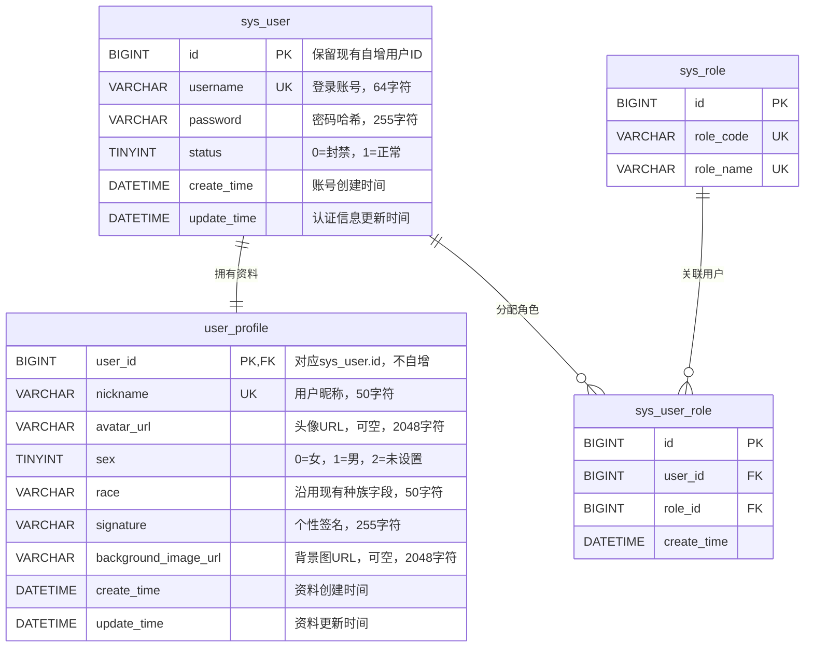

# v0.5.1 更新日志与设计说明

## 更新目标

- `feat` Markdown 编辑器切换为 Vditor；已有扩展功能继续保留，与 Vditor 原生功能重叠时优先使用原生实现。
- `feat` 统一全站字体，正文与界面使用系统无衬线字体栈，代码使用独立等宽字体栈。
- `feat` 亮色主题采用纯白主背景与期刊式排版，保留暗色主题。
- `feat` 认证信息与用户资料分表存储。
- `feat` 用户个人主页增加资料卡背景图，数据库字段为 `background_image_url`，接口字段为 `backgroundImageUrl`。
- `feat` 博客编辑区增加可选封面图，数据库字段为 `cover_url`，接口字段为 `coverUrl`。
- `refactor` 头像、背景图和封面图统一保存完整图片 URL，由后端生成或校验，前端直接使用。

## 更新说明

### 1. 前端更新

#### 1.1 编辑器与阅读渲染

工作区已有改动：

- 博客编辑页接入 `VditorEditor`，默认使用所见即所得模式，提供模式切换、预览、全屏、撤销和重做。
- 保留图片上传、代码高亮、代码语言标识与行号、图片说明、符号配对，以及 Mermaid 图表和思维导图的显示增强。
- 工具栏固定在顶部导航下方，全屏时固定在编辑器顶部；保存等业务操作继续由页面处理。
- 公开博客阅读页使用 `VditorPreview`，编辑与阅读共用渲染增强逻辑，并响应亮暗主题切换。
- 正文仍以 Markdown 保存，切换编辑器不改变 `blog.content` 的数据格式。

待完成确认：旧文章中的代码、表格、公式、图表和图片链接应能正常阅读；编辑后保存不得意外丢失内容。编辑器切换不要求批量重写历史正文。

#### 1.2 字体与视觉样式

工作区已有改动：

- 全站使用统一字体变量；界面与正文优先采用 Segoe UI、苹方、微软雅黑等系统字体，缺失时使用系统回退字体。
- 代码区域使用 Cascadia Code、SFMono-Regular、Consolas 等等宽字体，避免跟随正文的比例字体。
- 亮色主题主背景调整为纯白，使用浅灰辅助背景、细分隔线和红色强调色；暗色主题单独配置背景、文字和强调色。
- 调整首页、博客列表、文章详情、个人主页、导航与认证页面的布局，移除粒子背景，统一阅读宽度、间距和文字层级。
- 博客列表与个人主页文章列表复用文章卡片；博客列表提取分页加载逻辑，切换筛选条件后忽略旧请求结果，失败页允许重试。

背景图与博客封面目前尚未接入，以下章节说明拟定的数据与交互设计。

### 2. 认证信息与用户资料分离

#### 2.1 职责与关系

当前昵称、头像、性别等资料与账号、密码共同保存在 `sys_user`。例如修改头像与校验登录密码都会访问同一用户实体，资料查询也可能读入不必要的密码字段。

本版本拟拆分为：

- `sys_user`：保存用户身份、登录账号、密码哈希、账号状态及时间字段。
- `user_profile`：保存昵称、头像、性别、种族、个性签名和资料卡背景图。
- `sys_user_role`、`sys_role`、`sys_role_perm`、`sys_perm`：继续维护角色与权限；授权关系不迁入资料表。

`user_profile.user_id` 同时作为主键和关联用户的外键，与 `sys_user.id` 共享用户标识。正常业务中每个账号对应一条资料记录，不额外生成资料 ID。博客、评论、点赞等表继续使用原用户 ID，避免拆表影响历史归属。

图中的关联表示设计关系；现有初始化脚本未定义上述物理外键。新资料表建议显式添加 `FOREIGN KEY (user_id) REFERENCES sys_user(id)`，两端类型保持一致。主键已满足按用户查询及外键列索引需求，不再重复建立 `idx_user_id`。物理外键不能强制每个账号都有资料，完整性仍需注册事务和迁移校验保证。参考 [MySQL 外键约束说明](https://dev.mysql.com/doc/refman/8.4/en/create-table-foreign-keys.html)。

#### 2.2 字段与业务约束

- `username` 保留现有唯一约束，昵称迁移后保留 `uk_nickname`，避免本次拆表同时改变昵称唯一性规则。
- `password` 保存密码哈希，不保存明文；沿用字段名以减少迁移范围。公开资料查询和返回对象不包含密码字段。
- `nickname` 保留数据库长度 50；当前资料修改接口限制为 1–10 字符，拆表阶段不自动放宽，注册、资料编辑和管理接口应统一校验规则。
- `sex` 保留现有枚举，`race`、`signature` 保留现有含义和长度。默认值继续沿用现有业务规则。
- 图片字段允许 `NULL`，表示未设置；不使用空字符串、字符串 `"null"` 或默认图片文件名作为缺省标记。URL 字段的 2048 字符是本项目拟定上限，不是协议规定，接口校验与数据库长度需一致。
- 两张表分别维护 `update_time`。修改资料不应更新认证表的时间；原注册时间仍由 `sys_user.create_time` 表示。
- 注册时在同一数据库事务中创建账号、资料和默认角色关系，任一步失败全部回滚。账号封禁仍由 `sys_user.status` 控制，不能通过修改资料绕过。

#### 2.3 接口与查询改造

保留现有认证、用户资料及博客接口路径，调整内部实体、查询与字段：

| 入口 | 拟定改动 |
| --- | --- |
| 登录与密码修改 | 仅使用认证字段及既有角色、权限关系 |
| `GET /api/users/me` | 合并当前账号允许展示的信息与资料，不返回密码哈希 |
| `GET /api/users/{id}` | 查询公开资料；不因拆表增加账号状态等内部信息的公开范围 |
| `PUT /api/users/me` | 写入资料表，增加 `backgroundImageUrl`，补齐现有 `signature` 的编辑支持 |
| `POST /api/users/me/avatar` | 更新资料表头像，返回完整 `avatarUrl` |
| 博客、评论作者与管理用户查询 | 从资料表读取昵称和头像，账号状态仍从认证表读取 |

新增接口字段采用 camelCase，数据库字段采用 snake_case。旧响应中的 `avatar` 在过渡期继续保留，统一返回完整 URL；新字段使用 `avatarUrl`。上传响应中的 `avatarKey` 暂时保留以兼容旧客户端，但不得把 URL 写入名为 Key 的字段。

资料修改暂保留现有 `PUT` 路径，兼容旧请求缺少新增字段的情况：未提供 `backgroundImageUrl` 时保持原值，显式传入 `null` 时清除，传入有效 URL 时替换。实现需能区分“字段缺省”和“字段为 null”，不能仅依赖一个可空字符串属性。

资料变化也影响缓存和搜索：更新头像或昵称后刷新作者资料缓存；昵称改变时，对该作者的公开博客触发既有 Outbox 索引同步，避免搜索结果仍显示旧昵称。

### 3. 图片 URL 与文件管理

#### 3.1 存储与返回规则

当前头像实际保存的是相对路径或存储键，例如 `2026/09/30/123.png`；前端再根据环境拼接资源地址。新增背景图和封面图后，拟统一由后端处理图片地址，减少各页面重复拼接规则。

例如旧头像键 `2026/09/30/123.png`，按当前头像资源路由转换为 `https://nobeta.cn/bbs/i/avatar/2026/09/30/123.png`。迁移时应使用真实资源路由，避免漏掉 `avatar/` 或重复拼接。

| 用途 | 数据库字段 | 新接口字段 | 未设置时 |
| --- | --- | --- | --- |
| 用户头像 | `user_profile.avatar_url` | `avatarUrl` | 显示默认头像 |
| 资料卡背景 | `user_profile.background_image_url` | `backgroundImageUrl` | 使用主题默认背景 |
| 博客封面 | `blog.cover_url` | `coverUrl` | 使用无封面布局 |

- 三类图片保存完整、可长期访问的 HTTP(S) URL；生产环境使用 HTTPS，开发环境允许本地 HTTP 地址。
- 后端通过配置的公共资源基地址生成上传 URL，前端直接绑定，不再自行补域名或目录。过渡期保留现有头像解析逻辑以兼容旧数据。
- 持久化字段不接受 `blob:` 临时地址、`data:` 内嵌图片、服务器本地文件路径或会过期的签名 URL。浏览器本地预览可以使用临时地址，保存前必须完成上传。
- 本版本优先复用项目上传后的资源；外部图片地址若需支持，必须显式定义允许的来源与校验规则。
- 完整 URL 保存于业务表，不代表文件管理表也改存 URL。文件清理继续使用服务端记录的存储键与引用关系，不能直接把客户端 URL 当作本地删除路径。

上传能力需要从“仅头像”扩展到头像、资料背景和博客封面，统一规定类型、大小限制及返回字段。现有 `/api/uploadImage` 正文图片上传链路继续保留，新增图片用途不要求迁移历史 Markdown 图片链接。

#### 3.2 资料背景与博客封面

- 资料编辑支持上传、预览、替换和移除背景图，仅允许修改本人资料；保存成功后个人主页展示新背景。
- `blog` 新增可空的 `cover_url VARCHAR(2048)`；新增字段不建立索引，不参与全文搜索。
- 博客编辑支持上传、预览、替换和移除封面，创建与编辑请求、公开与私有详情及列表响应均同步增加 `coverUrl`。
- 保留既有博客写权限与发布规则，封面操作不改变作者、目录或发布状态。旧客户端未提供 `coverUrl` 时，编辑保留原封面；创建默认为 `NULL`；显式传入 `null` 清除封面。
- 列表卡片、个人主页文章列表及文章详情根据封面是否存在选择布局，图片加载失败时回退到无图布局。
- 公开列表优先从 Elasticsearch 查询，因此搜索文档与同步逻辑也需携带 `coverUrl`；同步失败时由既有重试、对账机制修复。涉及映射变化时按实际索引结构更新，并补齐历史公开文档。
- 更换或移除图片后，仅在确认没有其他有效引用时清理旧文件。现有 `AvatarCleanupTask` 的引用检查需适配资料表，并扩展到新增图片用途，避免误删或遗漏。

### 4. 数据迁移与兼容

数据库结构变化采用“新增、回填、切换、清理”的顺序，避免直接删除仍被旧代码读取的字段：

1. 拟新增 `infra/mysql/v0.5.1.sql`，创建 `user_profile`，为 `blog` 添加 `cover_url`；同步更新完整初始化脚本。
2. 按原用户 ID 回填资料，复制昵称、性别、种族、签名与时间字段；头像相对路径按配置转换为完整 URL。已有效的完整 URL 保留，历史缺省标记转换为 `NULL`。迁移需可重复执行，且不得覆盖迁移后已修改的资料。
3. 验证每个用户恰有一条资料、无孤立资料，昵称唯一约束与字段长度满足要求。为已有博客设置空封面，避免制造不存在的资源地址。
4. 切换注册、认证、资料、作者、管理、文件清理、缓存及 Elasticsearch 同步逻辑，同时更新前端类型与图片显示。
5. 先保留旧字段和过渡响应；确认旧客户端与旧查询不再依赖它们后，另行执行破坏性字段清理。清理前保留数据库备份及字段对应关系。

切换阶段建议短暂暂停相关写入后完成最终回填。若必须持续写入，则需在过渡期同步维护新旧字段；仅做一次回填无法覆盖迁移期间的资料修改。回滚到旧代码前也要同步切换后的新资料，否则旧代码会读到过期值。