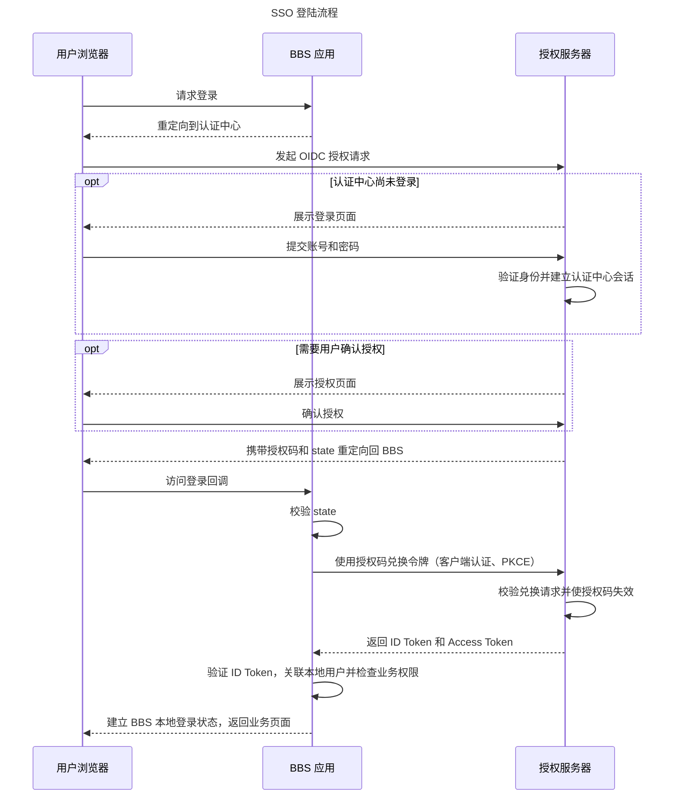
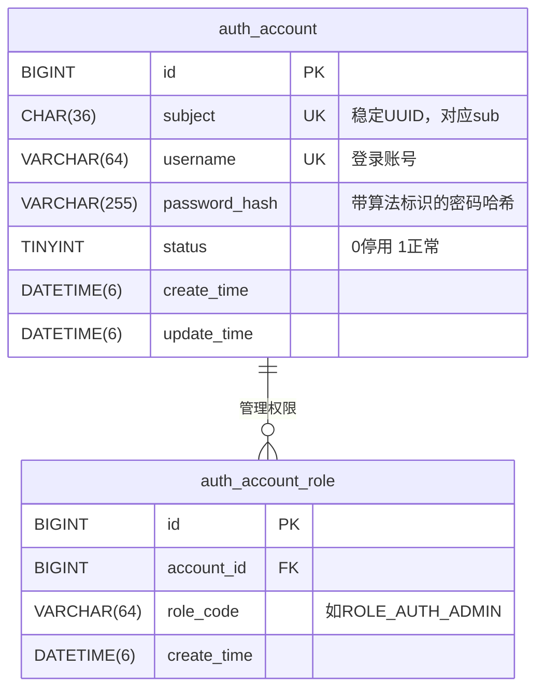
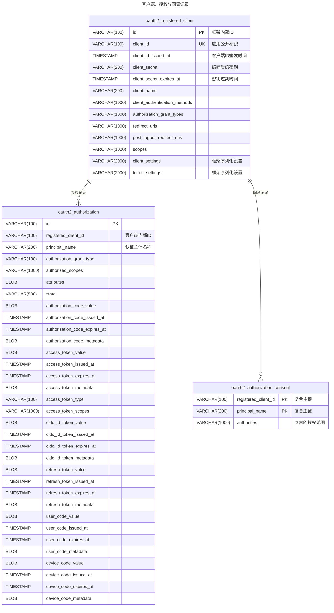

## 更新目标

构造 **SSO** *(Single Sign-On)* 系统：多个应用共用同一个登陆中心，但独立管理自己的业务权限。

新建基于 OAuth 2.0 / OIDC 的统一认证中心，作为授权服务器及身份提供方；BBS 业务服务作为客户端接入，为多个应用共享登录提供基础。

> **[Noshow](https://nobeta.cn)** 将和 Para BBS 使用同一认证中心，将二者的账户合一。

## 更新说明

原先实现使用单一应用的双 Token 方案，在 SSO 中，需要对服务身份进行重新定位：

- `bbs` ：**RP** *(Relying Party)* 作为业务后端，维护传统业务。
- `auth-server` ：**OP** *(OpenID Provider)* 作为认证中心微服务，提供 SSO 协议端点及其服务实现。

### 1. 认证中心

认证中心 `auth-server` 是独立运行的应用，基于 *Spring Security + Spring Authorization Server* 构建，遵循 OIDC 协议标准，根路径为 `https://nobeta.cn/auth` 。

Spring Authorization Server 提供 OAuth2.0 / OIDC 协议处理，账号注册、密码管理、账号状态等业务由项目实现，不自行编写授权码、令牌端点或 JWT 签名协议。实现优先级：**标准协议** → **Spring** **组件** → 必要的业务。

> 为认证中心新增一个前端 `auth`。

#### 1.1 职责

认证中心统一管理用户账号（账号、密码哈希，状态，登陆注册等），并维护登陆会话 *(Session)*。

认证中心使用 MySQL 保存账号和协议记录，Redis 保存 Session。

#### 1.2 客户端与协议

使用统一认证中心服务的应用，应当登记为客户端，并配置 `client_id`、凭证、登陆回调地址、退出回调地址。

此版本 SSO 使用标准授权码流程和 PKCE `S256` ，scope 应覆盖 `openid`。

BBS 后端作为能保管凭证的机密客户端；客户端认证证明应用身份，PKCE 将授权码绑定到本次登陆请求。

#### 1.3 协议端点

认证中心维护以下协议端点：

| 端点                                  | 调用者                 | 用途                 |
| ------------------------------------- | ---------------------- | -------------------- |
| `/login`                            | 用户浏览器             | 登陆认证中心         |
| `/oauth2/authorize`                 | 浏览器                 | 发起授权流程         |
| `/oauth2/token`                     | BBS 后端               | 兑换授权码或刷新令牌 |
| `/.well-known/openid-configuration` | BBS 后端               | 查询协议配置         |
| `/oauth2/jwks`                      | 客户端                 | 获取验证签名公钥     |
| `/userinfo`                         | 持有访问呢令牌的客户端 | 获取用户信息         |
| `/connect/logout`                   | 浏览器                 | 发起认证中心退出     |
| `/oauth2/revoke`                    | 客户端                 | 请求撤销令牌         |

#### 1.4 开发落地

Para BBS 项目 `backend/auth-server` 作为独立 Spring Boot 应用，独立部署和启动。

| 依赖                                                | 用途                                   |
| --------------------------------------------------- | -------------------------------------- |
| `spring-boot-starter-web`                         | 提供 HTTP 服务和账号业务入口           |
| `spring-boot-starter-oauth2-authorization-server` | 提供授权服务器协议能力及 Security 集成 |
| `spring-boot-starter-thymeleaf`                   | 直接渲染登陆、注册等页面               |
| MySQL、MyBatis、Redis 等驱动                        |                                        |

##### 1.4.1 数据库设计

账号模型使用 `auth_account` 、` auth_account_role` 表。协议记录使用框架原生的三张表。

> 图中仅展示核心字段与设计关系，不作为完整建表脚本。`registered_client` 还包含认证方式、授权方式、scope、退出回调及令牌配置等字段，使用所选框架版本附带的 SQL 脚本，检查 MySQL 类型兼容性，不按简图重新设计协议表。

##### 1.4.2 认证过滤器链

认证中心配置两条 `SecurityFilterChain`，区分处理 OIDC 与普通认证服务：

| 顺序          | 匹配范围                   | 职责                   |
| ------------- | -------------------------- | ---------------------- |
| `@Order(1)` | 框架授权服务器端点匹配器   | 处理 OAuth / OIDC      |
| `@Order(2)` | 登陆、账号业务及管理员入口 | 处理普通认证服务和业务 |

##### 1.4.3 客户端登记管理

| 方法与路径                                    | 行为                                       |
| --------------------------------------------- | ------------------------------------------ |
| `POST /api/admin/clients`                   | 创建客户端并返回一次性展示的原始密钥       |
| `GET /api/admin/clients`                    | 分页查询，按客户端 ID、名称及状态筛选      |
| `GET /api/admin/clients/{id}`               | 查询详情，不返回密钥或哈希                 |
| `PUT /api/admin/clients/{id}`               | 完整更新可编辑配置                         |
| `PUT /api/admin/clients/{id}/status`        | 启用或停用，重复设置同一状态不产生额外变化 |
| `POST /api/admin/clients/{id}/secret/reset` | 重置密钥，旧密钥立即不能用于新的客户端认证 |

### 2. BBS 改造